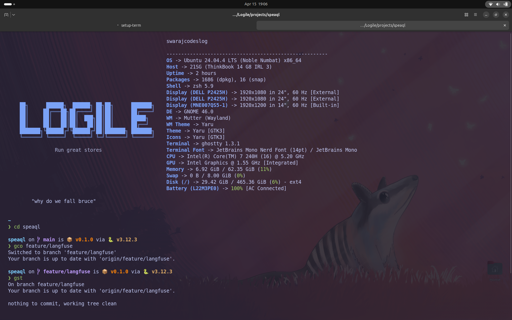

# dotfiles — Terminal Setup Guide

A modern terminal setup with Ghostty + Zsh + Fastfetch.



---

## What's Included

| File | Purpose |
|------|---------|
| `zsh/.zshrc` | Zsh shell config with plugins, aliases, and tools |
| `fastfetch/config.jsonc` | Fastfetch system info layout |
| `fastfetch/logile.txt` | ASCII logo displayed on terminal start |
| `ghostty/config` | Ghostty terminal theme (Tokyo Night glass) |

---

## Prerequisites

Install these before starting:

```bash
sudo apt update
sudo apt install zsh git curl build-essential cmake
```

---

## Step 1 — Install Zsh & Set as Default

```bash
# Verify zsh is installed
zsh --version

# Set as default shell
chsh -s $(which zsh)
```

Log out and log back in for the change to take effect.

---

## Step 2 — Install Fastfetch

Fastfetch is not in the default Ubuntu repos, so build it from source:

```bash
# Install build dependencies
sudo apt install -y cmake gcc g++ git

# Clone and build
git clone https://github.com/fastfetch-cli/fastfetch.git
cd fastfetch
mkdir -p build && cd build
cmake ..
make
sudo make install

# Verify
fastfetch --version
```

---

## Step 3 — Install Optional Tools

These power the zsh features (fuzzy search, smart cd, better ls, etc.):

```bash
# fzf and fd
sudo apt install fzf fd-find

# eza (modern ls)
sudo apt install -y gpg
sudo mkdir -p /etc/apt/keyrings
wget -qO- https://raw.githubusercontent.com/eza-community/eza/main/deb.asc | sudo gpg --dearmor -o /etc/apt/keyrings/gierens.gpg
echo "deb [signed-by=/etc/apt/keyrings/gierens.gpg] http://deb.gierens.de stable main" | sudo tee /etc/apt/sources.list.d/gierens.list
sudo apt update && sudo apt install eza

# starship prompt
curl -sS https://starship.rs/install.sh | sh

# zoxide (smart cd)
curl -sSfL https://raw.githubusercontent.com/ajeetdsouza/zoxide/main/install.sh | sh
```

---

## Step 4 — Clone & Apply Configs

```bash
# Clone this repo
git clone git@github.com:swarajcodeslog/dotfiles.git
cd dotfiles

# Backup existing configs
[ -f ~/.zshrc ] && mv ~/.zshrc ~/.zshrc.backup

# Apply zsh config
cp zsh/.zshrc ~/.zshrc

# Apply fastfetch config
mkdir -p ~/.config/fastfetch
cp fastfetch/config.jsonc ~/.config/fastfetch/config.jsonc
cp fastfetch/logile.txt ~/.config/fastfetch/logile.txt

# Apply ghostty config
mkdir -p ~/.config/ghostty
cp ghostty/config ~/.config/ghostty/config
```

---

## Step 5 — Reload Shell

```bash
exec zsh
```

Zinit will automatically install all zsh plugins on first run.

---

## Features & How to Use

### Shell Plugins (auto-active)

| Feature | How it works |
|---------|-------------|
| Syntax highlighting | Commands turn green (valid) or red (invalid) as you type |
| Autosuggestions | Grey text appears — press `→` to accept |
| ESC ESC | Press Escape twice to prepend `sudo` to any command |

### Keyboard Shortcuts

| Shortcut | Action |
|----------|--------|
| `Ctrl+R` | Fuzzy search command history |
| `Ctrl+T` | Fuzzy search files |
| `Alt+C` | Fuzzy search and cd into a directory |
| `↑` / `↓` | Search history matching current input |

### Aliases

```bash
# Navigation
..          # cd ..
...         # cd ../..
mkcd foo    # mkdir + cd in one command

# Files
ls          # eza with icons
ll          # detailed list with git status
lt          # tree view 2 levels
lta         # tree view 3 levels (all files)

# Git
gst         # git status
gco         # git checkout
gp          # git push
gl          # git pull
glog        # pretty git log graph

# Shell
c / cls     # clear
reload      # reload .zshrc
zshrc       # open .zshrc in editor
extract     # extract any archive format
```

### Zoxide (smart cd)

```bash
# Visit a directory once normally
cd ~/some/deep/path/myproject

# From then on, jump from anywhere
cd myproject
```

---

## Ghostty Fonts

The config uses JetBrains Mono Nerd Font. Install it for icons to render correctly:

```bash
sudo apt install fonts-jetbrains-mono
```

Or download Nerd Font variant from: https://www.nerdfonts.com/font-downloads

---

## Customization

### Change the ASCII logo
Edit `~/.config/fastfetch/logile.txt` with your own ASCII art.

### Change the quote
Edit `~/.zshrc` and find:
```bash
printf "\t\"why do we fall bruce\"\n"
```

### Add your own aliases
Edit `~/.zshrc` under the `# ALIASES` section, then run `reload`.
